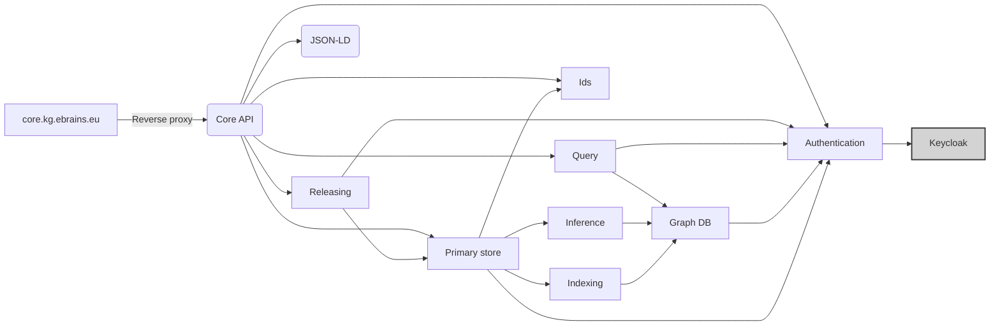

# Components and dependencies
The EBRAINS KG Core consists of a set of microservices fulfilling specific tasks within 
the KG ecosystem.

[//TODO]: <> (Why microservices?)

## Core API

The Core API is the publicly exposed interface (mapped via reverse proxy) and therefore the central entry point of all "core"-external clients.

**The components' main concerns** 

- Normalization of incoming payloads: Whenever a JSON-LD payload is passed via the API (e.g. ingestion, contribution, query), this component ensures that these payloads are normalized for further processing inside the core environment   
- Filtering of outgoing payloads: Ensures that internal properties and/or filtered elements are removed from the response.   
- Initial authentication: A first check of authentication (e.g. if the user & client tokens are valid) to fail fast   
- Orchestration of API calls: One of the main purposes of this API is to orchestrate the API calls to the various services involved in the exposed functionalities.   

**Technology:** Spring Boot

## JSON-LD
The normalization service for JSON-LD payloads.

**The components' main concerns**   

- Take a JSON-LD payload and normalize it according to the normalization convention

**Technologies:**  Spring Boot

## Releasing

The releasing component provides the required functionality to release an instance

**The components' main concerns**

- Preparation of the required events for the releasing of an instance and the trigger of the Primary Store

**Technology:** Spring Boot

## Primary store
The primary store is the place where the incoming events are recorded and dispatched to the other components (e.g. indexing, inference, etc.). This is the "event source" for the system.

**The components' main concerns**

- Recording and dispatch events
- Provide an SSE stream for asynchronous clients

**Database:** ArangoDB (kg-events, kg-users)

**Technology:** Spring Boot

## Ids
The services taking care of the id tracking.

**The components' main concerns**   

- Keeping track of the system-defined ids and their mappings to external identifiers. 
- Provide resolution services for internal- and external identifiers

**Database:** ArangoDB (kg-ids)

**Technology:** Spring Boot

## Query
The query component allows to execute queries on the graph. It coordinates the calls to the different indices and the reconciliation of their results (e.g. in the case of a spatial search).
**The components' main concerns**

- Coordinating the query execution on all indices

**Technology:** Spring Boot

## Inference
The inference mechanism is one of the key components in terms of consolidation logic. It allows us to translate multiple contributions into entity-representing instances.

**The components' main concerns**   

- Find documents which contribute to the values of an instance
- Consolidate the found documents incl. the generation of alternatives
- Prepare required events for their ingestion

**Technology:** Spring Boot

## Indexing
The indexing component coordinates the indexing of individual events into the different indexes. For now, these are the GraphDB and Spatial search - the abstraction of indexing does allow a simple extension of this though.

**The components' main concerns**

- Triggering the indexing of an event to one or multiple of the index databases if appropriate

**Technology:** Spring Boot

## GraphDB
The GraphDB is the "heart" of the KG core. It translates the events and query definitions into database transactions or native db queries respectively.
[//TODO]: <> (Sync vs. async)

**The components' main concerns**

- Creating database transactions to insert/update/delete data and its dependencies
- Lazy resolution of links
- Extraction of statistical information for fast database reflection
- Query translation to AQL

**Database:** ArangoDB (kg-native, kg-inProgress, kg-release, kg-structure)

**Technology:** Spring Boot

## Authentication
The authentication service is an abstraction layer for the underlying auth system. It allows (if the credentials with appropriate rights are provided) to set-up clients and roles according to the conventions of the EBRAINS Knowledge Graph. It also validates the signature of the token and read user profiles.

**The components' main concerns**   

- Building the link to the authentication system (Keycloak)
- Validation of tokens 
- Ensuring conventions in terms of roles and translating them into the kg-core internal models
- Providing services for authentication and user information

**Technology:** Spring Boot 
**Database:** ArangoDB (kg-authentication)

## Dependencies
KG Core has the following dependencies on external services   

- Keycloak / iam.ebrains.eu: For authentication

