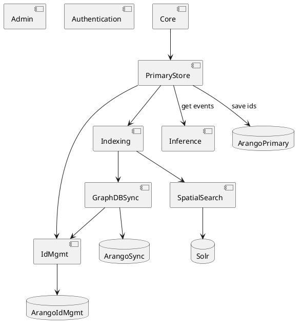

# KG microservices

The Knowledge Graph is following the microservices approach. Here are the different components and their groupings:

## Entry points

### kg-core-api
**Description**: Orchestrating and unifying the public API   
**Dependencies**: TBD

### kg-nexus-v0-adapter   
**Description**: An endpoint, Nexus v0 can deliver its events to the primarystore (incl. id translation)
**Dependencies**: kg-primarystore

### kg-nexus-v1-adapter
**Description**: A SSE event listener connected to a Nexus V1 instance, interpreting the events and forwarding them to the primarystore service for further processing.
**Dependencies**: kg-primarystore

### kg-indexing
**Description**: Orchestrates the indexing process of an incoming payload (incl. triggering inference / semantical interpretation - such as releasing) in the graph db and spatial search    
**Dependencies**: TBD

## Access control
### kg-authentication
**Description**: Wrapper around the authentication mechanism (currently Keycloak)   
**Dependencies**: -

### kg-permissions
**Description**: User management (read & manipulate)   
**Dependencies**: *kg-authentication* (validating token)

### kg-admin
**Description**: Manages primary resources such as "clients" and "spaces"   
**Dependencies**: *kg-graphdb*, *kg-permissions*

## Query

### kg-query:
**Description**: Orchestrate multi-model queries and apply query adapters if appropriate
**Dependencies**: *kg-graphdb*, *kg-spatial-search*, *kg-query-adapter*

### kg-query-adapter*:
**Description**: An adapter which can be applied to a query result (e.g. to create elasticsearch mappings or re-transform the query result). 
**Dependencies**: -

## Persistence

### kg-primarystore:
**Description**: The primary store of the KG following the event-sourcing approach (recording the events sequentially). Provides CRUD operations and trigger SSEs (current implementation: Nexus)
**Dependencies**: - 

### kg-graphdb:
**Description**: Index and read data in/from an optimized graph structure by declarative query (current implementation: Arango)
**Dependencies**: *kg-permissions* (ensure access rights), *kg-spec-to-aql* (translate queries to aql)

### kg-spatial-search:
**Description**: Index and read data in/from a spatial search index (current implementation: Solr)
**Dependencies**: *kg-permissions* (ensure access rights)

## Indexing

### kg-inference:
**Description**: Reconcile instances based on multiple contributions   
**Dependencies**: *kg-graphdb* (read from native and write to inferred database) 

## Releasing

### kg-releasing:
**Description**: Release instances (take a snapshot and save it in the released section)    
**Dependencies**: *kg-graphdb* (read from inferred and write to released database), *kg-spatial-search* (read from inferred and write to released database) 

## Utils

### kg-jsonld
**Description**: Normalizing JSON-LD payloads (translating payloads into the compacted format with fully resolved context)   
**Dependencies**: -

### kg-spec-to-aql
**Description**: The translator between the generic, declarative query and the actual AQL query executable on the persistence layer   
**Dependencies**: *kg-graphdb* (to fetch existing collections)

## Infrastructure

### kg-service-discovery
**Description**: A simple wrapper for Eureka to provide the service discovery functionality.   
**Dependencies**: - 

