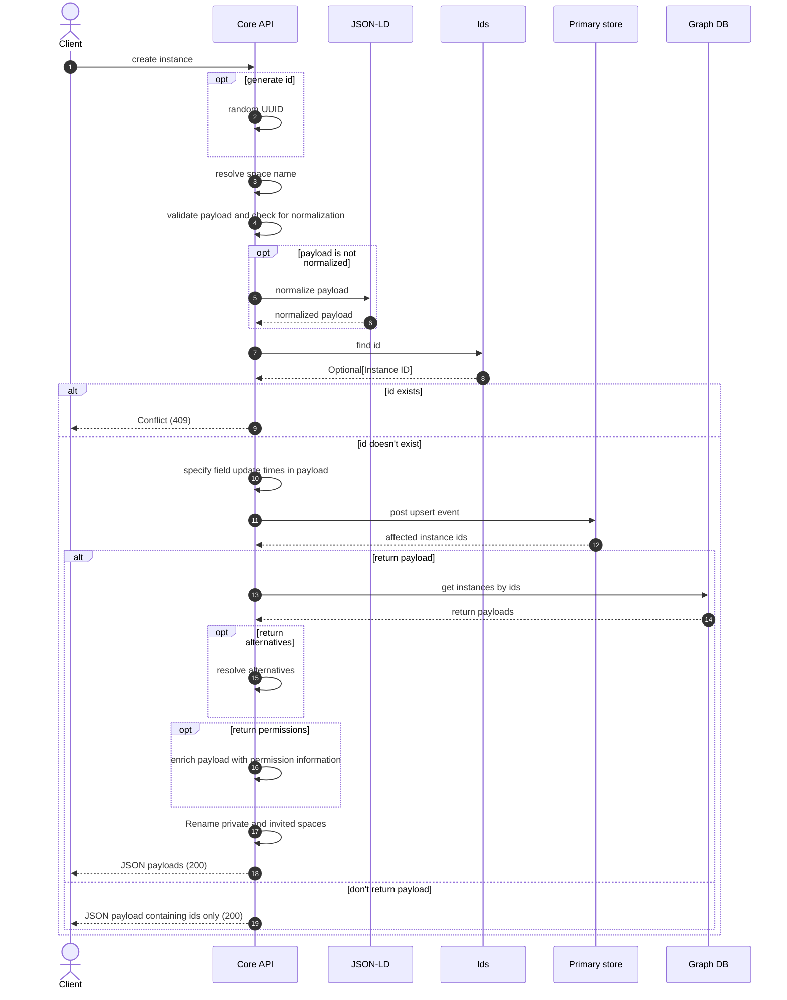
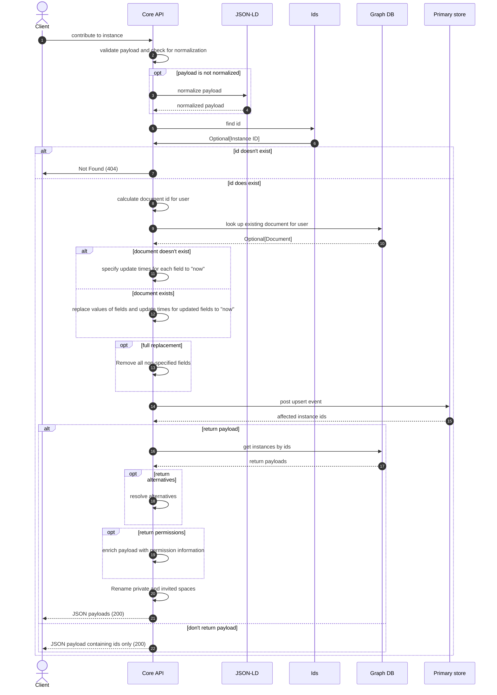
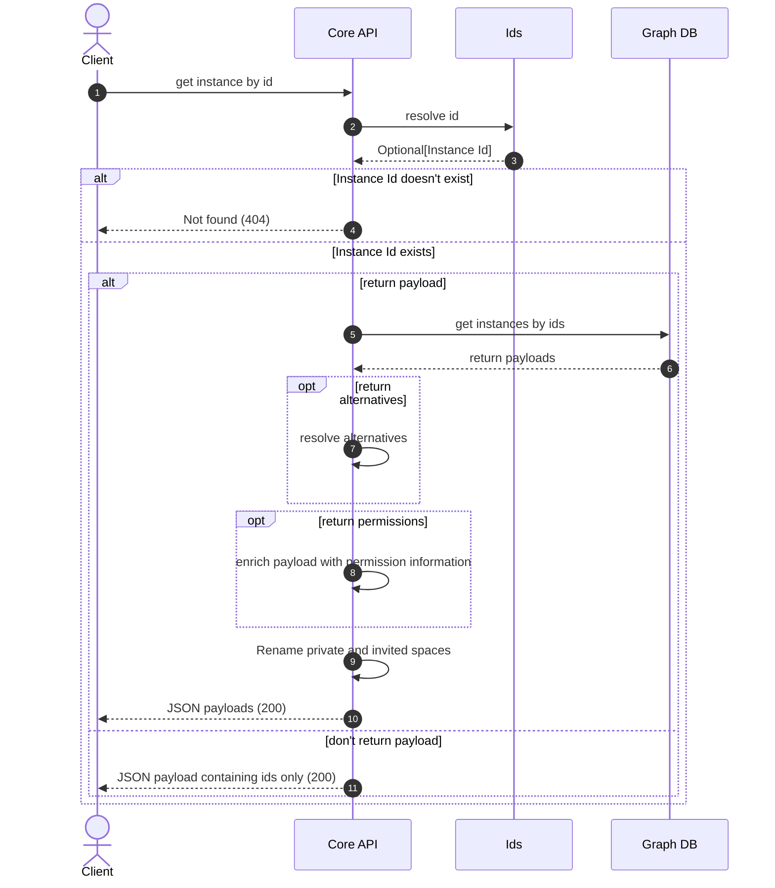
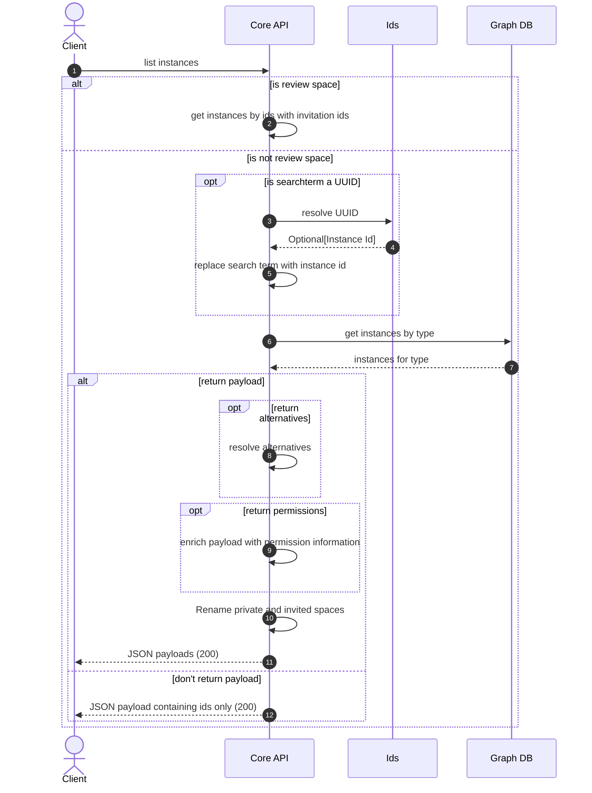
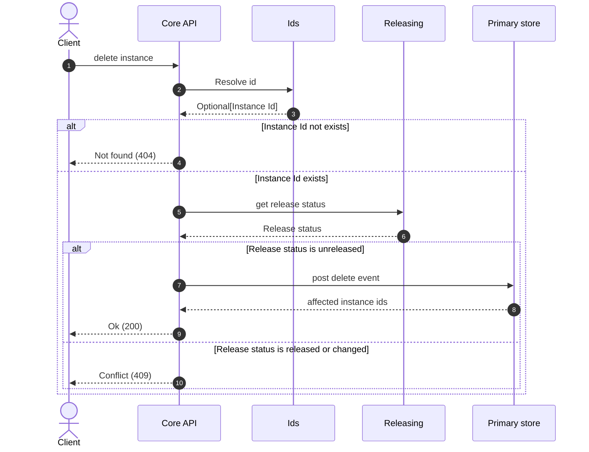

# Instances 

## Create instances

```mermaid
sequenceDiagram   
  autonumber
  actor Client
  Client ->> Core API: create instance
  opt generate id
    Core API ->> Core API: random UUID
  end
  Core API ->> Core API: resolve space name
  Core API ->> Core API: validate payload and check for normalization
  opt payload is not normalized
      Core API ->> JSON-LD: normalize payload
      JSON-LD -->> Core API: normalized payload  
  end
  Core API ->> Ids: find id
  Ids -->> Core API: Optional[Instance ID]
  alt id exists
    Core API -->> Client: Conflict (409)
  else id doesn't exist
    Core API ->> Core API: specify field update times in payload
    Core API ->> Primary store: post upsert event
    Primary store -->> Core API: affected instance ids
    alt return payload
        Core API ->> Graph DB: get instances by ids
        Graph DB -->> Core API: return payloads
        opt return alternatives
            Core API ->> Core API: resolve alternatives
        end
        opt return permissions
            Core API ->> Core API: enrich payload with permission information
        end        
        Core API ->> Core API: Rename private and invited spaces
        Core API -->> Client: JSON payloads (200)
    else don't return payload
        Core API -->> Client: JSON payload containing ids only (200)
    end
  end   
```

## Contribute to instances

```mermaid
sequenceDiagram   
  autonumber
  actor Client
  Client ->> Core API: contribute to instance
  Core API ->> Core API: validate payload and check for normalization
  opt payload is not normalized
      Core API ->> JSON-LD: normalize payload
      JSON-LD -->> Core API: normalized payload  
  end
  Core API ->> Ids: find id
  Ids ->> Core API: Optional[Instance ID]
  alt id doesn't exist
    Core API ->> Client: Not Found (404)
  else id does exist
    Core API ->> Core API: calculate document id for user
    Core API ->> Graph DB: look up existing document for user
    Graph DB -->> Core API: Optional[Document]
    alt document doesn't exist
        Core API ->> Core API: specify update times for each field to "now"
    else document exists
        Core API ->> Core API: replace values of fields and update times for updated fields to "now"
    end
    opt full replacement
        Core API ->> Core API: Remove all non-specified fields
    end
    Core API ->> Primary store: post upsert event
    Primary store -->> Core API: affected instance ids
    alt return payload
        Core API ->> Graph DB: get instances by ids
        Graph DB -->> Core API: return payloads
        opt return alternatives
            Core API ->> Core API: resolve alternatives
        end
        opt return permissions
            Core API ->> Core API: enrich payload with permission information
        end        
        Core API ->> Core API: Rename private and invited spaces
        Core API -->> Client: JSON payloads (200)
    else don't return payload
        Core API -->> Client: JSON payload containing ids only (200)
    end
  end
```

## Get instance

```mermaid
sequenceDiagram   
  autonumber
  actor Client
  Client ->> Core API: get instance by id
  Core API ->> Ids: resolve id
  Ids -->> Core API: Optional[Instance Id]
  alt Instance Id doesn't exist
      Core API -->> Client: Not found (404)
  else Instance Id exists
    alt return payload
        Core API ->> Graph DB: get instances by ids
        Graph DB -->> Core API: return payloads
        opt return alternatives
            Core API ->> Core API: resolve alternatives
        end
        opt return permissions
            Core API ->> Core API: enrich payload with permission information
        end
        Core API ->> Core API: Rename private and invited spaces
        Core API -->> Client: JSON payloads (200)
    else don't return payload
        Core API -->> Client: JSON payload containing ids only (200)
    end  
  end
```

## List instances

```mermaid
sequenceDiagram   
  autonumber
  actor Client
  Client ->> Core API: list instances
  alt is review space
    Core API ->> Core API: get instances by ids with invitation ids
  else is not review space
    opt is searchterm a UUID
       Core API ->> Ids: resolve UUID
       Ids -->> Core API: Optional[Instance Id]
       Core API ->> Core API: replace search term with instance id
    end
    Core API ->> Graph DB: get instances by type
    Graph DB -->> Core API: instances for type
    alt return payload
        opt return alternatives
            Core API ->> Core API: resolve alternatives
        end
        opt return permissions
            Core API ->> Core API: enrich payload with permission information
        end
        Core API ->> Core API: Rename private and invited spaces
        Core API -->> Client: JSON payloads (200)
    else don't return payload
        Core API -->> Client: JSON payload containing ids only (200)
    end  
  end
```

## Delete instances

```mermaid
sequenceDiagram   
  autonumber
  actor Client
  Client ->> Core API: delete instance
  Core API ->> Ids: Resolve id
  Ids -->> Core API: Optional[Instance Id]
  alt Instance Id not exists
    Core API -->> Client: Not found (404)
  else Instance Id exists
    Core API ->> Releasing: get release status
    Releasing -->> Core API: Release status
    alt Release status is unreleased
        Core API ->> Primary store: post delete event
        Primary store -->> Core API: affected instance ids
        Core API -->> Client: Ok (200)
    else Release status is released or changed
        Core API -->> Client: Conflict (409)
    end
  end
```