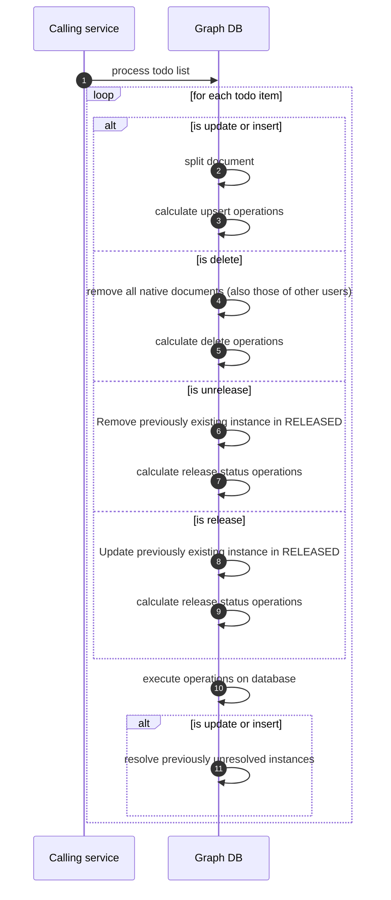
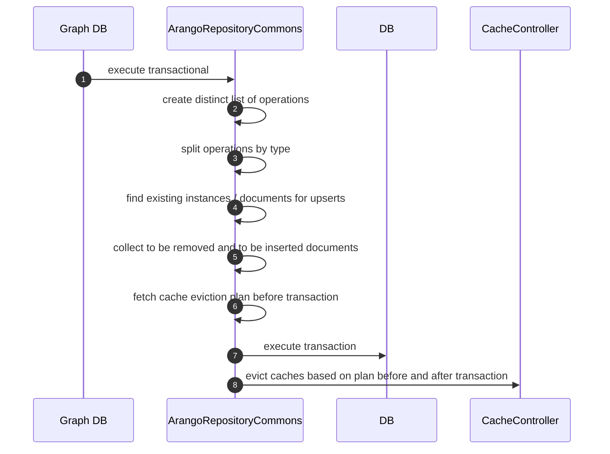

# Graph DB 

## Process TodoList

```mermaid
sequenceDiagram   
  autonumber
  Calling service ->> Graph DB: process todo list  
  loop for each todo item
    alt is update or insert
        Graph DB ->> Graph DB: split document
        Graph DB ->> Graph DB: calculate upsert operations
    else is delete
        Graph DB ->> Graph DB: remove all native documents (also those of other users)
        Graph DB ->> Graph DB: calculate delete operations    
    else is unrelease
       Graph DB ->> Graph DB: Remove previously existing instance in RELEASED
       Graph DB ->> Graph DB: calculate release status operations
    else is release
       Graph DB ->> Graph DB: Update previously existing instance in RELEASED
       Graph DB ->> Graph DB: calculate release status operations
    end
    Graph DB ->> Graph DB: execute operations on database
    alt is update or insert
        Graph DB ->> Graph DB: resolve previously unresolved instances
    end
  end
```

## Execute operations

```mermaid
sequenceDiagram   
  autonumber
  Graph DB ->> ArangoRepositoryCommons: execute transactional
  ArangoRepositoryCommons ->> ArangoRepositoryCommons: create distinct list of operations
  ArangoRepositoryCommons ->> ArangoRepositoryCommons: split operations by type
  ArangoRepositoryCommons ->> ArangoRepositoryCommons: find existing instances / documents for upserts
  ArangoRepositoryCommons ->> ArangoRepositoryCommons: collect to be removed and to be inserted documents
  ArangoRepositoryCommons ->> ArangoRepositoryCommons: fetch cache eviction plan before transaction
  ArangoRepositoryCommons ->> DB: execute transaction
  ArangoRepositoryCommons ->> CacheController: evict caches based on plan before and after transaction  
```