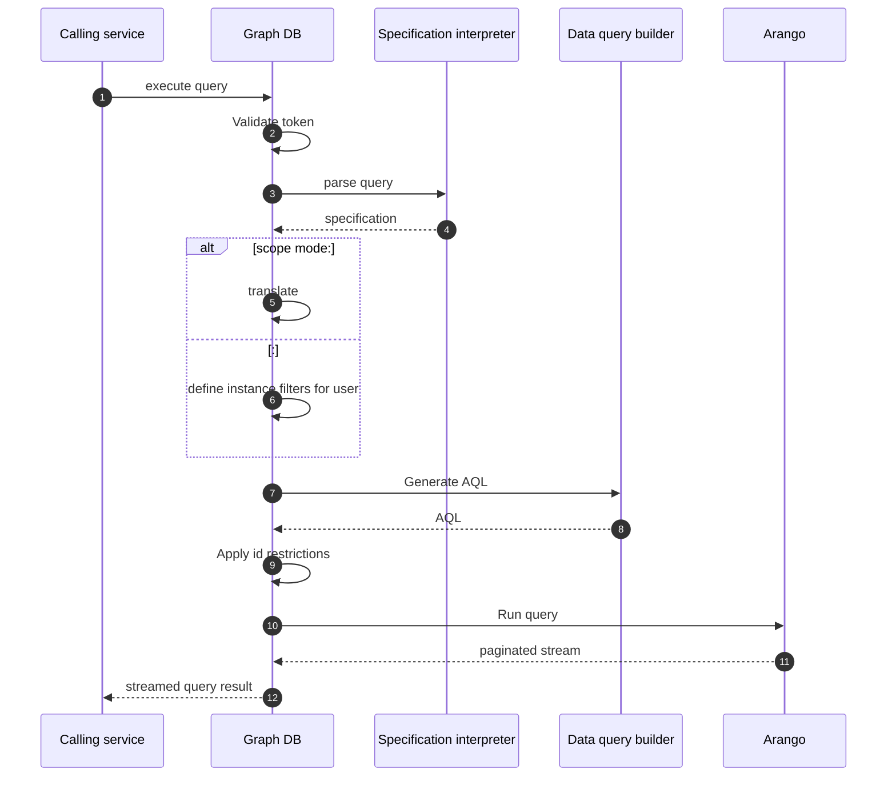

# GraphDB queries API

3: parse, normalize and generate a model for the query specification   
5: translate the query to only return scope information only (ids of involved instances). Please note, that we're explicitly not setting the filters in this mode since no data (other than ids) is exposed.
