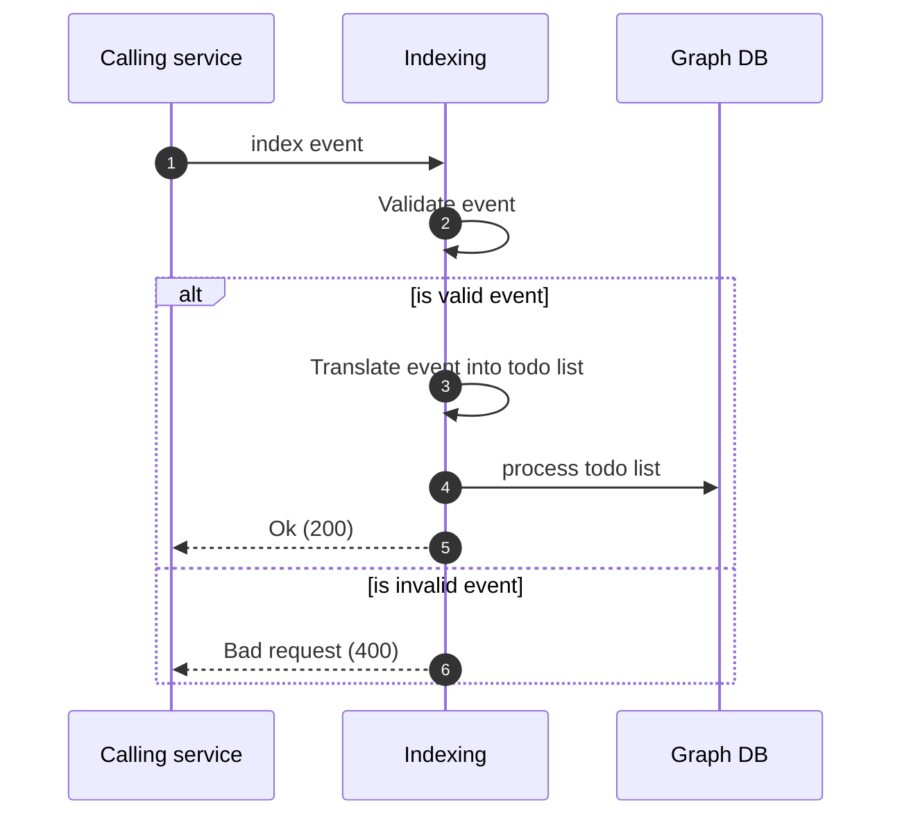

# Indexing

## Index event

```mermaid
sequenceDiagram   
  autonumber
  Calling service ->> Indexing: index event
  Indexing ->> Indexing: Validate event
  alt is valid event
      Indexing ->> Indexing: Translate event into todo list 
      Indexing ->> Graph DB: process todo list
    Indexing -->> Calling service: Ok (200)
  else is invalid event
    Indexing -->> Calling service: Bad request (400)
  end
```
