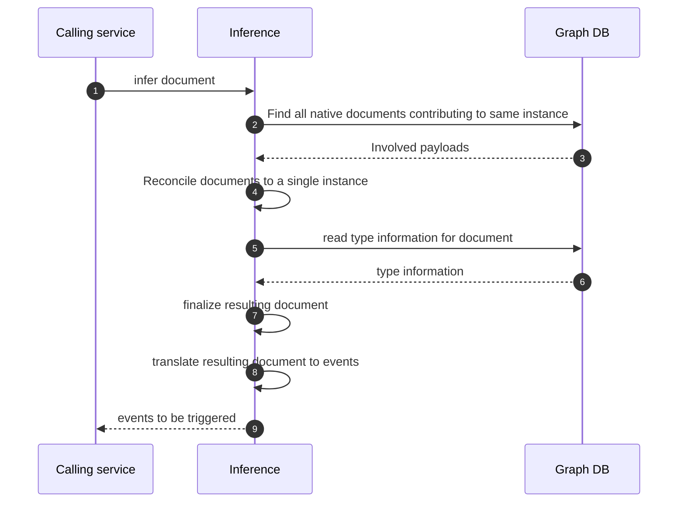

# Inference

## Infer

```mermaid
sequenceDiagram   
  autonumber
  Calling service ->> Inference: infer document
  Inference ->> Graph DB: Find all native documents contributing to same instance
  Graph DB -->> Inference: Involved payloads
  Inference ->> Inference: Reconcile documents to a single instance
  Inference ->> Graph DB: read type information for document
  Graph DB -->> Inference: type information
  Inference ->> Inference: finalize resulting document
  Inference ->> Inference: translate resulting document to events
  Inference -->> Calling service: events to be triggered
```
