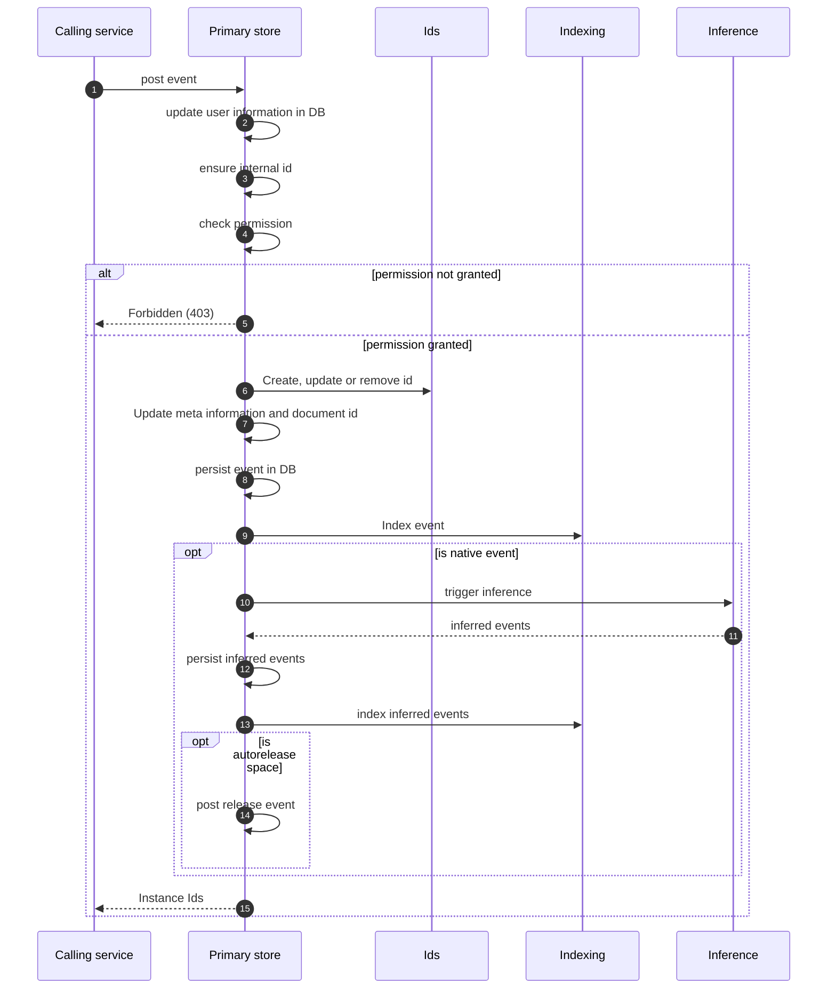

# Primary store

## Post event

```mermaid
sequenceDiagram   
  autonumber
  Calling service ->> Primary store: post event  
  Primary store ->> Primary store: update user information in DB
  Primary store ->> Primary store: ensure internal id  
  Primary store ->> Primary store: check permission
  alt permission not granted
     Primary store -->> Calling service: Forbidden (403)
  else permission granted
     Primary store ->> Ids: Create, update or remove id
     Primary store ->> Primary store: Update meta information and document id
     Primary store ->> Primary store: persist event in DB
     Primary store ->> Indexing: Index event
      opt is native event
         Primary store ->> Inference: trigger inference
         Inference -->> Primary store: inferred events
         Primary store ->> Primary store: persist inferred events
         Primary store ->> Indexing: index inferred events
         opt is autorelease space
            Primary store ->> Primary store: post release event
         end
      end
      Primary store -->> Calling service: Instance Ids  
  end
```
